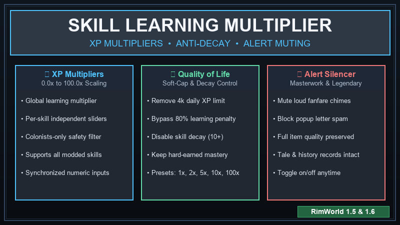

# 🎓 Skill Learning Multiplier for RimWorld

**Skill Learning Multiplier** gives you complete, granular control over XP progression and skill retention in RimWorld. Configure XP gains globally or per-skill from **0.0x to 100.0x**, eliminate annoying vanilla XP penalties, and stop high-level skill decay!

---

## ✨ Key Features

* **📈 0.0x to 100.0x XP Multipliers:** Adjust learning rates from complete cessation (0x) to lightning-fast mastery (100x).
* **🎯 Global or Per-Skill Control:** Apply a single multiplier across the board, or fine-tune every skill (Shooting, Melee, Construction, Crafting, Medicine, etc.) independently. Supports all vanilla and dynamically loaded modded skills!
* **⚡ 1-Click Quick Presets:** Instantly set all multipliers to `1x (Vanilla)`, `2x`, `5x`, `10x`, `25x`, `50x`, `100x`, or Reset to defaults.
* **🛡️ Colonists-Only Protection:** Safely restrict multipliers to player colony members so raiders, visitors, and enemies don't gain unfair advantages.
* **🔓 Bypass Daily XP Soft-Cap:** RimWorld normally throttles skill learning to 20% once a colonist earns 4,000 XP in a single day. This toggle completely removes that cap.
* **🛑 Disable Skill Level Decay:** In vanilla, skills above level 10 bleed XP constantly over time. Keep your colonists' hard-earned mastery intact by toggling decay off.
* **🔕 Mute Masterwork & Legendary Alerts:** High-multiplier crafters generate Masterwork and Legendary items rapidly, causing loud letter chime spam. Toggle this option to completely mute the alert sounds and popup letter envelopes while keeping item quality and art history intact!
* **🔄 Synchronized Sliders & Text Inputs:** Real-time synchronized UI with input buffers for seamless slider and keyboard adjustments.
* **🌐 Multilingual:** Native English and Turkish (*Türkçe*) translations.

---

## 🎮 How to Use

1. Launch RimWorld and go to **Options ➔ Mod Settings ➔ Skill Learning Multiplier**.
2. Toggle quality-of-life options (Colonists Only, Disable Daily Cap, Disable Skill Decay, Mute Alerts).
3. Use quick preset buttons or adjust the global / individual skill sliders.
4. Changes apply immediately in-game without needing a restart!

---

## 📋 Requirements
- **RimWorld:** `1.5` or `1.6`
- **Harmony:** [`brrainz.harmony`](https://steamcommunity.com/sharedfiles/filedetails/?id=2009463077) (Must be loaded before this mod).

---

## 📁 Installation
1. Download from the [Releases](https://github.com/SadSeal5/Rimworld-Skill-learning-multiplier/releases) tab.
2. Place the folder into `RimWorld/Mods/SkillLearningMultiplier/`.
3. Activate Harmony and then Skill Learning Multiplier in the mod list.
